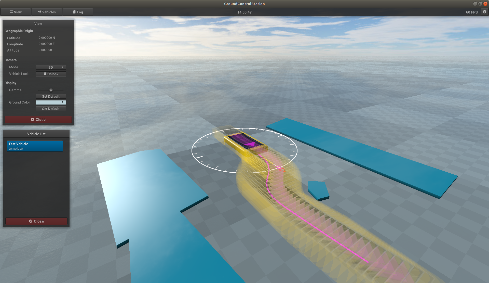

# Ground Control Station (GCS)

During software development and testing of automated vehicles, it is always helpful to have a graphical interface that allows intuitive observation of the mission status at a glance.
The software of autonomous vehicles is usually divided into guidance, navigation and control systems.
The basic data exchange can be based on the [Inter-Module Protocol (IMP)](https://github.com/RobertDamerius/InterModuleProtocol).
In order to display such IMP messages graphically, the GCS tool was developed.
The directory structure of this repository is as follows.

| File / Directory   | Description                                                                                                  |
| :----------------- | :----------------------------------------------------------------------------------------------------------- |
| bin                | contains the release application including documentation and files required at runtime                       |
| doc                | contains the documentation that can be created with [SimpleDoc](https://github.com/RobertDamerius/SimpleDoc) |
| source             | whole source code of the GCS                                                                                 |
| LICENSE            | license information                                                                                          |
| Makefile           | Makefile used to build the GCS                                                                               |
| README.md          | this file                                                                                                    |


> **Windows**<br>
> On Windows you can either download the latest binary file from [Google Drive](https://drive.google.com/drive/folders/14GFyZsQlfEtYMduogP3NErJT3p2pbXHF?usp=sharing) or build the software from the source code yourself using [MSYS2/MinGW64](https://www.msys2.org).

> **Linux**<br>
> On Linux you can build the software yourself.

> **Other OS**<br>
> On other operating systems, you must build the software yourself. If you use a GNU compiler and the GNU make tool, you may be able to use the same Makefile with a few adjustments.

### Revision History
| Date        | Version  | Description                                                                                               |
| :---------- | :------- | :-------------------------------------------------------------------------------------------------------- |
| 2020-09-21  | 1.0      | Initial release                                                                                           |
| 2020-11-11  | 1.1      | Added text-to-speech output for [IMP Log Messages](https://github.com/RobertDamerius/InterModuleProtocol) |
| 2021-01-13  | 1.2      | Added configuration file for inserting vehicles to the empty database when the GCS starts                 |
| 2021-03-01  | 1.3      | Added highlighting of navigation and guidance state data in vehicle data panel                            |
| 2021-07-01  | 1.4      | Updated IMP protocol to latest version and limited numeric string lengths                                 |




## How To Use
The GCS can receive UDP messages as Unicast and Multicast.
Before the application is started, the network configuration file must be adjusted so that the GCS opens the appropriate UDP ports to receive IMP messages.
To make sure that the association of messages with vehicles is clear, the GCS uses the Info Request Message of the Inter-Module Protocol.
Participants receiving an Info Request Message should reply with an Info Response Message.
The GCS then builds up a vehicle database internally.
For more information, see the [web-based documentation](bin/documentation/) that comes with the software.

## How To Build
At the moment I have less time to deal with build tools like CMake or Automake.
Maybe somebody has time and wants to help me.
At the moment you need the GNU make tool and a GNU compiler that supports the C++17 standard.
If your header files for required libraries are in a different location than mine, you can change this in `/source/precompiled/PreCompiled.hpp`.
If the corresponding libraries to be linked against are named differently, you can change this in the `Makefile` on line 30 (Windows) or 31 (Linux).

### External libraries required
Some third-party source code files are already present in the source directory. These include
[NanoVG](https://github.com/memononen/nanovg), [NanoGUI](https://github.com/wjakob/nanogui), [LodePNG](https://github.com/lvandeve/lodepng) and [Earcut](https://github.com/mapbox/earcut).
All other required external libraries are shown in the following table.

| Library                                      | Windows (MSYS2/MinGW64)                               | Linux (Ubuntu)                                          | Comment                                          |
| :------------------------------------------- | :---------------------------------------------------- | :------------------------------------------------------ | :----------------------------------------------- |
| OpenGL                                       | already comes with MSYS2/MinGW64                      | `sudo apt install build-essential libgl1-mesa-dev`      | OpenGL                                           |
| [GLFW3](https://github.com/glfw/glfw)        | `pacman -S mingw-w64-x86_64-glfw`                     | `sudo apt install libglfw3-dev`                         | used to create window and OpenGL-context         |
| [GLEW](http://glew.sourceforge.net)          | build from [source](http://glew.sourceforge.net)      | `sudo apt install libglew-dev`                          | OpenGL extension wrangler library                |
| [GLM](https://github.com/g-truc/glm)         | `pacman -S mingw-w64-x86_64-glm`                      | `sudo apt install libglm-dev`                           | OpenGL mathematics                               |
| [Freetype](https://www.freetype.org)         | build from [source](https://www.freetype.org)         | `sudo apt install libfreetype6-dev`                     | required by NanoVG, NanoGUI to use fonts         |
| [Eigen3](https://gitlab.com/libeigen/eigen)  | `pacman -S mingw-w64-x86_64-eigen3`                   | `sudo apt install libeigen3-dev`                        | required by NanoGUI                              |


### Build procedure
The Makefile is designed to work with the default GNU compiler (GCC) under Linux and the MinGW toolchain under Windows.

**Prepare**<br>
You can use the following command to clean up before a rebuilding:
```
make clean
```
The source directory contains a directory called `/source/precompiled`.
All headers that appear within this directory are automatically included during the compilation process.
In this way external headers only need to be included once.
To speed up compilation, all headers within that directory can be precompiled with the command:
```
make pch
```
This command creates precompiled headers in the same source directory (with the file extension *.gch).
Note that these precompiled headers are also deleted when `make clean` is called.
The precompiled headers need to be generated only once.
Additionally, a build directory is created that contains all object and dependency files when compiling.


**Compile and link**<br>
Use the command
```
make
```
to compile all sources and link them together to the final software product.
The final product is written to the `bin` directory.
If you have made changes to some code files and recompiled them with `make`, only the sources affected by these changes will be recompiled.
Be careful when renaming sources or moving them to other directories, because then the build directory is no longer consistent with the source directory, which can lead to errors.
In this case a complete rebuilding is recommended.

